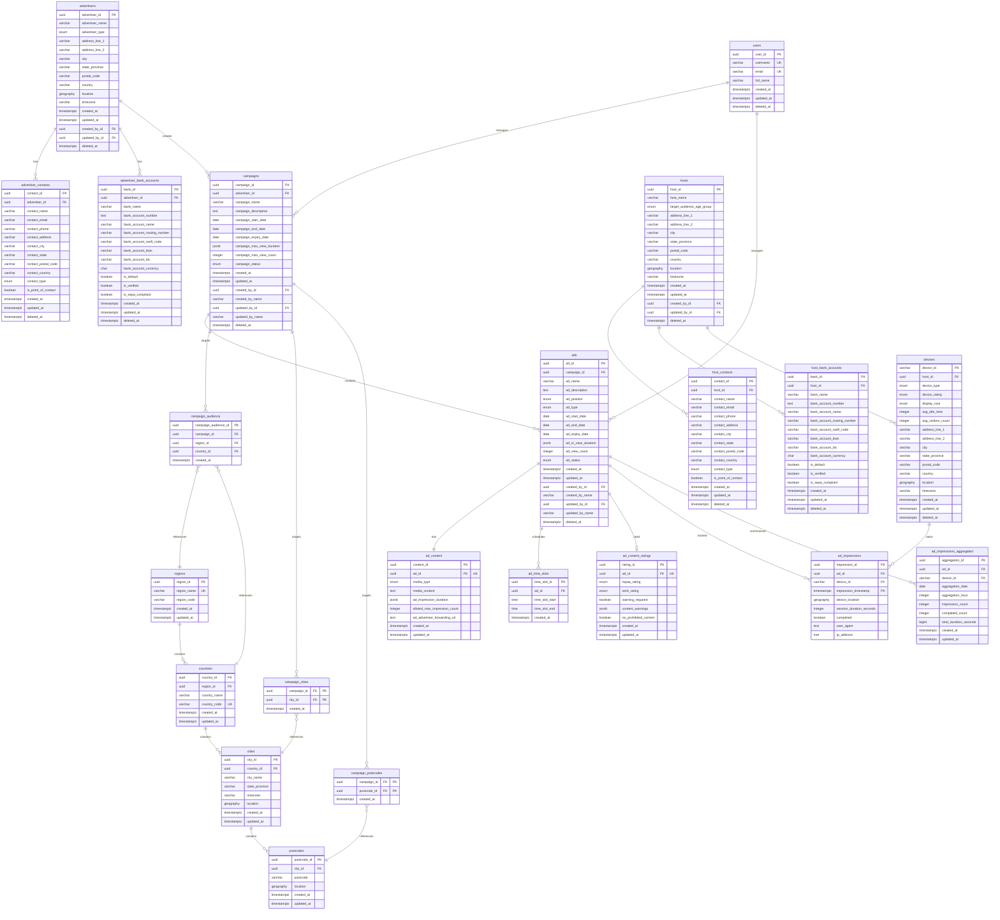

# Car Infotainment Ad Platform - Database Schema ERD

## Entity Relationship Diagram

## Key Relationships

### Core Entity Relationships

1. **Advertisers → Campaigns → Ads**
   - An advertiser creates multiple campaigns
   - Each campaign contains multiple ads
   - Ads are placed in specific positions on the device screen

2. **Hosts → Devices**
   - A host owns/operates multiple devices
   - Devices are physical locations where ads are displayed

3. **Geographic Hierarchy**
   - Regions contain countries
   - Countries contain cities
   - Cities contain postcodes
   - Used for campaign audience targeting

### Targeting & Filtering

4. **Campaign Audience Targeting**
   - Campaigns target specific regions, countries, cities, and postcodes
   - Many-to-many relationships via junction tables
   - Geographic filtering for ad delivery

5. **Ad Content & Scheduling**
   - Each ad has one content record (1:1)
   - Ads can have multiple time slots for scheduling
   - Content ratings are optional (0:1)

### Analytics & Tracking

6. **Impressions**
   - Tracks every ad view on every device
   - Partitioned by timestamp for performance
   - Aggregated table for faster analytics queries

## Enum Types

- **advertiser_type_enum**: individual, business, enterprise, agency
- **contact_type_enum**: admin, manager, sales, support, marketing, tech, it, hr, finance, operations, technical
- **device_type_enum**: shop, car, house
- **device_rating_enum**: economy, standard, premium, luxury
- **display_size_enum**: s, m, l, xl, xxl
- **status_enum**: active, inactive, paused, draft, expired
- **ad_position_enum**: top_bar_ad, bottom_left_ad, bottom_right_ad, bottom_center_ad, center_right_content_ad, center_left_content_ad
- **ad_type_enum**: image_only_ad, multimedia_ad
- **media_type_enum**: text, image, gif, video, html, news_rss, events, breaking_news, alerts
- **time_unit_enum**: seconds, minutes, hours, days
- **age_group_enum**: 0-5, 6-12, 13-18, 19-35, 36-55, 55+
- **mpaa_rating_enum**: G, PG, PG-13, R, NC-17
- **esrb_rating_enum**: E, E10+, T, M, AO

## Indexes & Performance

Key indexes for optimal query performance:

1. **Geographic Indexes** (GIST): On all GEOGRAPHY columns for spatial queries
2. **Campaign/Ad Status Indexes**: Composite indexes on status + date ranges
3. **Impression Indexes**: On ad_id + device_id + timestamp
4. **Foreign Key Indexes**: Automatically created on all FK columns

## Partitioning Strategy

- **ad_impressions**: Partitioned by month for scalability
- Allows efficient data management and archival
- Improves query performance for recent data

