# Car Infotainment Ad Platform - Database Schema ERD

## Entity Relationship Diagram

```mermaid
erDiagram
    regions ||--o{ countries : contains
    countries ||--o{ cities : contains
    cities ||--o{ postcodes : contains
    
    advertisers ||--o{ advertiser_contacts : has
    advertisers ||--o{ advertiser_bank_accounts : has
    advertisers ||--o{ campaigns : has
    
    users ||--o{ advertisers : "admin creates"
    users ||--o{ hosts : "admin creates"
    users ||--o{ campaigns : "campaign_manager creates"
    users ||--o{ ads : "campaign_manager creates"
    
    hosts ||--o{ device_groups : has
    hosts ||--o{ host_contacts : has
    hosts ||--o{ host_bank_accounts : has
    hosts ||--o{ ad_display_device : owns
    
    device_groups ||--o{ ad_display_device : "device assigned to max 1"
    
    ad_display_device ||--|| device_details : "1-1"
    
    campaigns ||--o{ ads : contains
    campaigns ||--o{ campaign_audience : targets
    campaigns ||--o{ campaign_cities : targets
    campaigns ||--o{ campaign_postcodes : targets
    
    campaign_audience }o--|| regions : references
    campaign_audience }o--|| countries : references
    campaign_cities }o--|| cities : references
    campaign_postcodes }o--|| postcodes : references
    
    ads ||--|| ad_content : has
    ads ||--o{ ad_time_slots : schedules
    ads ||--o| ad_content_ratings : rated
    ads ||--o{ ad_impressions : tracked
    
    regions {
        uuid region_id PK
        varchar region_name UK
        varchar region_code
        timestamptz created_at
        timestamptz updated_at
    }
    
    countries {
        uuid country_id PK
        uuid region_id FK
        varchar country_name
        varchar country_code UK
        timestamptz created_at
        timestamptz updated_at
    }
    
    cities {
        uuid city_id PK
        uuid country_id FK
        varchar city_name
        varchar state_province
        varchar timezone
        geography location
        timestamptz created_at
        timestamptz updated_at
    }
    
    postcodes {
        uuid postcode_id PK
        uuid city_id FK
        varchar postcode
        geography location
        timestamptz created_at
        timestamptz updated_at
    }
    
    advertisers {
        uuid advertiser_id PK
        varchar advertiser_code UK "unique across platform"
        varchar advertiser_name
        enum advertiser_type
        varchar address_line_1
        varchar address_line_2
        varchar city
        varchar state_province
        varchar postal_code
        varchar country
        geography location
        varchar timezone
        timestamptz created_at
        timestamptz updated_at
        uuid created_by_id FK
        uuid updated_by_id FK
        timestamptz deleted_at
    }
    
    advertiser_contacts {
        uuid contact_id PK
        uuid advertiser_id FK
        varchar contact_name
        varchar contact_email
        varchar contact_phone
        varchar contact_address
        varchar contact_city
        varchar contact_state
        varchar contact_postal_code
        varchar contact_country
        enum contact_type
        boolean is_point_of_contact
        timestamptz created_at
        timestamptz updated_at
        timestamptz deleted_at
    }
    
    advertiser_bank_accounts {
        uuid bank_id PK
        uuid advertiser_id FK
        varchar bank_name
        text bank_account_number
        varchar bank_account_name
        varchar bank_account_routing_number
        varchar bank_account_swift_code
        varchar bank_account_iban
        varchar bank_account_bic
        char bank_account_currency
        boolean is_default
        boolean is_verified
        boolean is_sepa_compliant
        timestamptz created_at
        timestamptz updated_at
        timestamptz deleted_at
    }
    
    hosts {
        uuid host_id PK
        varchar host_name
        enum target_audience_age_group
        varchar address_line_1
        varchar address_line_2
        varchar city
        varchar state_province
        varchar postal_code
        varchar country
        geography location
        varchar timezone
        timestamptz created_at
        timestamptz updated_at
        uuid created_by_id FK
        uuid updated_by_id FK
        timestamptz deleted_at
    }
    
    device_groups {
        uuid id PK
        uuid host_id FK
        varchar group_name
        enum status "active deleted paused"
        timestamptz created_at
        timestamptz updated_at
        uuid created_by_id FK
        uuid updated_by_id FK
    }
    
    host_contacts {
        uuid contact_id PK
        uuid host_id FK
        varchar contact_name
        varchar contact_email
        varchar contact_phone
        varchar contact_address
        varchar contact_city
        varchar contact_state
        varchar contact_postal_code
        varchar contact_country
        enum contact_type
        boolean is_point_of_contact
        timestamptz created_at
        timestamptz updated_at
        timestamptz deleted_at
    }
    
    host_bank_accounts {
        uuid bank_id PK
        uuid host_id FK
        varchar bank_name
        text bank_account_number
        varchar bank_account_name
        varchar bank_account_routing_number
        varchar bank_account_swift_code
        varchar bank_account_iban
        varchar bank_account_bic
        char bank_account_currency
        boolean is_default
        boolean is_verified
        boolean is_sepa_compliant
        timestamptz created_at
        timestamptz updated_at
        timestamptz deleted_at
    }
    
    ad_display_device {
        varchar device_id PK
        uuid host_id FK
        uuid device_group_id FK "max 1 group"
        enum device_type
        enum device_rating
        enum display_size
        integer avg_idle_time
        integer avg_visitors_count
        varchar address_line_1
        varchar address_line_2
        varchar city
        varchar state_province
        varchar postal_code
        varchar country
        geography location
        varchar timezone
        timestamptz created_at
        timestamptz updated_at
        timestamptz deleted_at
    }
    
    device_details {
        varchar device_id PK "FK to ad_display_device"
        text hardware_specifications
        text vendor_specification
        varchar vendor_name
        varchar vendor_part_number
        varchar vendor_serial_number
        text purchasing_details
        date purchase_date
        varchar purchase_order_number
        date warranty_expiry_date
        numeric purchase_price
        char currency
        text price_notes
        text notes
        varchar serial_number
        varchar model_number
        varchar firmware_version
        date installed_date
        date last_maintenance_date
        timestamptz created_at
        timestamptz updated_at
    }
    
    campaigns {
        uuid campaign_id PK
        varchar campaign_code UK "unique across platform"
        uuid advertiser_id FK
        varchar campaign_name
        text campaign_description
        varchar country "NOT NULL"
        varchar city "NOT NULL"
        varchar postcode "NOT NULL"
        date campaign_start_date
        date campaign_end_date
        date campaign_expiry_date
        jsonb campaign_max_view_duration
        integer campaign_max_view_count
        enum campaign_status
        timestamptz created_at
        timestamptz updated_at
        uuid created_by_id FK
        varchar created_by_name
        uuid updated_by_id FK
        varchar updated_by_name
        timestamptz deleted_at
    }
    
    campaign_audience {
        uuid campaign_audience_id PK
        uuid campaign_id FK
        uuid region_id FK
        uuid country_id FK
        timestamptz created_at
    }
    
    campaign_cities {
        uuid campaign_id FK "PK"
        uuid city_id FK "PK"
        timestamptz created_at
    }
    
    campaign_postcodes {
        uuid campaign_id FK "PK"
        uuid postcode_id FK "PK"
        timestamptz created_at
    }
    
    ads {
        uuid ad_id PK
        varchar ad_code UK "unique across platform"
        uuid campaign_id FK
        varchar ad_name
        text ad_description
        varchar country "nullable"
        varchar city "nullable"
        varchar postcode "nullable"
        enum ad_position
        enum ad_type
        date ad_start_date
        date ad_end_date
        date ad_expiry_date
        jsonb ad_in_view_duration
        integer ad_view_count
        enum ad_status
        timestamptz created_at
        timestamptz updated_at
        uuid created_by_id FK
        varchar created_by_name
        uuid updated_by_id FK
        varchar updated_by_name
        timestamptz deleted_at
    }
    
    ad_content {
        uuid content_id PK
        uuid ad_id FK "UK"
        enum media_type
        text media_content
        jsonb ad_impression_duration
        integer alloted_max_impression_count
        text ad_advertiser_forwarding_url
        timestamptz created_at
        timestamptz updated_at
    }
    
    ad_time_slots {
        uuid time_slot_id PK
        uuid ad_id FK
        time time_slot_start
        time time_slot_end
        timestamptz created_at
    }
    
    ad_content_ratings {
        uuid rating_id PK
        uuid ad_id FK "UK"
        enum mpaa_rating
        enum esrb_rating
        boolean warning_required
        jsonb content_warnings
        boolean no_prohibited_content
        timestamptz created_at
        timestamptz updated_at
    }
    
    ad_impressions {
        uuid impression_id PK
        uuid ad_id FK
        timestamptz impression_timestamp PK
        integer session_duration_seconds
        boolean completed
        text user_agent
        inet ip_address
    }
    
    ad_impression_events {
        uuid impression_id PK
        date impression_date PK "partition key"
        timestamptz impression_timestamp
        smallint impression_hour
        integer duration_seconds
        boolean completed
        uuid ad_id "denorm"
        varchar ad_code
        enum ad_type
        enum ad_position
        uuid campaign_id "denorm"
        uuid advertiser_id "denorm"
        varchar device_id "denorm"
        uuid host_id "denorm"
        uuid device_group_id "denorm"
        varchar device_city
        varchar device_postcode
        varchar device_country
        timestamptz created_at
    }
    
    impression_daily_rollups {
        uuid id PK
        varchar rollup_type "advertiser,campaign,city,system..."
        varchar dimension_id
        varchar dimension_label
        date impression_date
        bigint impression_count
        bigint completed_count
        bigint total_duration_seconds
        integer unique_devices_count
        integer unique_ads_count
        timestamptz created_at
        timestamptz updated_at
    }
    
    users {
        uuid user_id PK
        varchar username UK
        varchar email UK
        varchar full_name
        enum role "admin or campaign_manager"
        timestamptz created_at
        timestamptz updated_at
        timestamptz deleted_at
    }
```

## Key Relationships

### User Roles and Creation

1. **Users (admin)** create **advertisers** and **hosts**. Only admin users can create advertiser and host records (`advertisers.created_by_id`, `hosts.created_by_id` → `users`).
2. **Users (campaign_manager)** create **campaigns** and **ads**. Campaign managers create campaign and ad records (`campaigns.created_by_id`, `ads.created_by_id` → `users`).
3. **Advertisers** can have **multiple campaigns** (one-to-many).
4. **Campaigns** can have **multiple ads** (one-to-many).
5. **Advertisers, campaigns, and ads** are **unique across the platform** (primary key UUID plus unique business code: `advertiser_code`, `campaign_code`, `ad_code`).

### Core Entity Relationships

6. **Advertisers → Campaigns → Ads**
   - An advertiser has many campaigns
   - Each campaign has many ads
   - Ads are placed in specific positions on the device screen

7. **Hosts → Device groups → Ad display device → Device details**
   - A host has 0 or many device_groups (group_name, status: active/deleted/paused)
   - Each ad_display_device can be assigned to at most one device_group (device_group_id)
   - A host owns/operates multiple ad_display_devices; each is a physical location where ads are displayed
   - Each ad_display_device has 0 or 1 device_details (1-1): hardware specs, vendor, purchasing, prices, notes

8. **Geographic Hierarchy**
   - Regions contain countries
   - Countries contain cities
   - Cities contain postcodes
   - Used for campaign audience targeting

### Targeting & Filtering

9. **Campaign Audience Targeting**
   - Campaigns target specific regions, countries, cities, and postcodes
   - Many-to-many relationships via junction tables
   - Geographic filtering for ad delivery

10. **Ad Content & Scheduling**
   - Each ad has one content record (1:1)
   - Ads can have multiple time slots for scheduling
   - Content ratings are optional (0:1)

### Analytics & Tracking

11. **Impressions**
   - Tracks every ad view (no device link)
   - Partitioned by timestamp for performance

12. **Ad impression analytics datastore**
   - **ad_impression_events**: One row per impression from display_device; denormalized (ad, campaign, advertiser, device, device_group, location at impression time). No FKs so historical insights stay valid. Partitioned by impression_date. Enables scalable aggregation from device-level to advertiser-level and by date, city, postcode, device group.
   - **impression_daily_rollups**: Pre-aggregated daily counts by rollup_type (e.g. advertiser, campaign, device_group, city, postcode, system). Populate via batch from ad_impression_events for fast business reporting and dashboards.

## Enum Types

- **advertiser_type_enum**: individual, business, enterprise, agency
- **contact_type_enum**: admin, manager, sales, support, marketing, tech, it, hr, finance, operations, technical
- **device_type_enum**: shop, car, house
- **device_rating_enum**: economy, standard, premium, luxury
- **display_size_enum**: s, m, l, xl, xxl
- **status_enum**: active, inactive, paused, draft, expired
- **ad_position_enum**: top_bar_ad, bottom_left_ad, bottom_right_ad, bottom_center_ad, center_right_content_ad, center_left_content_ad
- **ad_type_enum**: image_only_ad, multimedia_ad
- **media_type_enum**: text, image, gif, video, html, news_rss, events, breaking_news, alerts
- **time_unit_enum**: seconds, minutes, hours, days
- **age_group_enum**: 0-5, 6-12, 13-18, 19-35, 36-55, 55+
- **mpaa_rating_enum**: G, PG, PG-13, R, NC-17
- **esrb_rating_enum**: E, E10+, T, M, AO
- **user_role_enum**: admin (creates advertisers and hosts), campaign_manager (creates campaigns and ads)
- **device_group_status_enum**: active, deleted, paused

## Indexes & Performance

Key indexes for optimal query performance:

1. **Geographic Indexes** (GIST): On all GEOGRAPHY columns for spatial queries
2. **Campaign/Ad Status Indexes**: Composite indexes on status + date ranges
3. **Impression Indexes**: On ad_id and timestamp
4. **Impression analytics**: ad_impression_events indexed by (impression_date), (advertiser_id, impression_date), (campaign_id, impression_date), (ad_id, impression_date), (device_id, impression_date), (host_id, impression_date), (device_group_id, impression_date), (device_city, impression_date), (device_postcode, impression_date), (device_country, impression_date); impression_daily_rollups by (rollup_type, impression_date), (dimension_id, impression_date)
5. **Foreign Key Indexes**: Automatically created on all FK columns

## Partitioning Strategy

- **ad_impressions**: Partitioned by month (impression_timestamp) for scalability
- **ad_impression_events**: Partitioned by month (impression_date) for analytics scale and retention
- Allows efficient data management and archival
- Improves query performance for recent data

